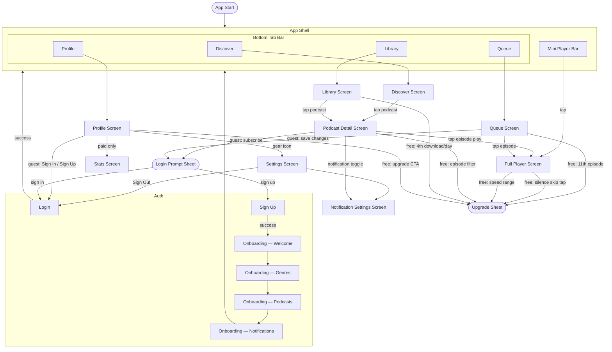

# Phase 3b — Mobile Features

## Goal
Implement full feature parity with the web app plus mobile-only features (downloads, lock screen,
push notifications, silence skipping), then ship to Google Play and the App Store.

All features follow the UDF pattern established in Phase 3a (see `docs/plans/phase-3a-mobile-setup.md`):
each feature gets a `<Feature>Feature.kt` (commonMain), `<Feature>Screen.kt` (commonMain),
and `<Feature>ViewModel.kt` (androidMain).

## Screens & User Flow

### Screen Inventory

#### Auth & Onboarding

| Screen | Contents |
|--------|----------|
| **Login** | Email + password; OAuth buttons; Forgot password link |
| **Sign Up** | Email + password; OAuth buttons |
| **Onboarding — Welcome** | Short app intro; "Get started" CTA |
| **Onboarding — Genre Selection** | Interest chips (Comedy, Tech, News, etc.); multi-select |
| **Onboarding — Suggested Podcasts** | Curated list based on selected genres; subscribe inline |
| **Onboarding — Notification Permission** | OS permission prompt with context message |

#### Main App (Bottom Tab Bar + Mini Player)

| Screen | Contents |
|--------|----------|
| **Discover** | "Discover" title; search bar ("Search podcasts, episodes..."); "Have a private feed? Add by URL" collapsed toggle (expands URL input → fetch preview → subscribe); genre filter chips (horizontally scrollable); Trending section (large 2-col artwork cards); podcast result grid (when searching); mini player bar |
| **Library** | "Library" title; "Subscriptions" section heading (drag-to-reorder with handle on right); "Downloads" section heading (paid: "Unlimited" purple pill); downloaded episode rows with play overlay, "Downloaded ✓" badge + MB + duration, three-dot menu; guest empty state (cloud-off icon, "Sign in to save podcasts", Sign In button); mini player bar |
| **Queue** | Screen title "Up Next" (tab label stays "Queue"); free-tier "X / 10 Free" pill badge; paid "Unlimited" purple pill (replaces free badge); episode rows with drag handle (left), artwork, title/podcast/time, trash + three-dot (right); inline upgrade card shown proactively near cap: heading "Queue Limit Reached Soon", body about 10-episode limit, "View Plans" full-width button; mini player bar |
| **Profile** | "Profile" title + gear icon (→ Settings); guest state: avatar placeholder + "Sign In / Sign Up" button + Premium card; logged-in state: avatar, name, email, tier badge ("FREE PLAN"/"PRO"), subscriptions horizontal scroll + "View All", Upgrade card (free only), Listening Stats section |

#### Shared / Deep-Navigated Screens

| Screen | Contents |
|--------|----------|
| **Podcast Detail** | Clear artwork hero; podcast title with bell icon beside it; genre/tag chips; expandable description ("Read more"); "▶ Play Latest" (filled purple) + "+ Follow / Unfollow" (outline) side-by-side buttons; three-dot overflow menu (top-right); "Episodes" heading + Sort button; episode filter pill near Sort (paid); episode rows (title, description snippet, date·duration, share/download/play icons, progress bar on in-progress) |
| **Full Player** | Artwork, title, podcast name; scrubber + chapter markers; play/pause/skip ±15s; speed selector (1x/2x free — 0.5x–3x paid); silence skip toggle (paid only); sleep timer; queue-ahead preview |
| **Settings** | Back + "Settings" title; PREFERENCES group (Notification Settings, Playback Defaults); DATA & ACCOUNT group (OPML Import/Export with lock icon — paid, Manage Subscription, Sign Out — destructive red); app version footer |
| **Notification Settings** | Master on/off toggle; per-podcast toggle list (mirrors per-podcast toggle on Podcast Detail); episode filter patterns (paid) |
| **Stats** | Total listening time (30-day, from `listening_daily`); listening by day of week (bar chart); monthly trend; top shows by listening time; episodes completed per show (from `listening_by_show`); streak (paid only — accessible from Profile). Requires web stats implementation first — mobile reads same API. |

#### Sheets (inline — no full-screen navigation)

| Sheet | Trigger |
|-------|---------|
| **Upgrade Sheet** | Hitting any free-tier limit: queue cap, speed range, silence skip, download quota, episode filter |
| **Login Prompt Sheet** | Guest taps Subscribe, saves queue changes, or navigates to Profile |

---

### Navigation Flow

---

### Free vs Paid Feature Gates

| Feature | Free | Paid |
|---------|------|------|
| Queue size | 10 episodes | Unlimited |
| Playback speed | 1x / 2x only | 0.5x – 3x full range |
| History retention | 30 days | Full (while subscribed) |
| Downloads | 3 / day | Unlimited |
| Silence skipping | — | ✓ |
| Episode filter patterns (notifications) | — | ✓ |
| Listening stats | — | ✓ |
| OPML import / export | — | ✓ |
| Banner ads in player | ✓ | — |
| Guest browsing (Discover, Library, Queue, Podcast Detail) | ✓ | ✓ |
| Queue cap indicator | "X / 10 Free" pill + inline upgrade card | "Unlimited" purple pill |

Subscription pricing matches web: **$4.99/month or $50/year** via in-app purchase (Apple / Google Play billing).
Free-tier gates generally show an **Upgrade Sheet** (bottom sheet). Exception: the Queue screen shows an **inline upgrade card** within the list itself (heading "Queue Limit Reached Soon", body about the 10-episode limit and silence skipping, "View Plans" full-width button) rather than interrupting flow with a sheet. The card appears proactively before the cap is reached.

---

## Planned

### Core Features (parity with web)
- [ ] Auth — `AuthFeature` + `AuthScreen`; Supabase KMP Auth client; email + Google OAuth;
      Apple sign-in for iOS (expect/actual OAuth handler)
- [ ] Podcast search + subscribe — `SearchFeature` + `SearchScreen`; calls Supabase Edge Function
      (`/functions/v1/podcasts-search`); results rendered in lazy column
- [ ] Subscribe by URL — collapsed "Add by URL" section on Discover screen; calls `/api/podcasts/feed?url=...&limit=1` for preview then `POST /api/subscriptions`; handles 401/403 upstream errors with "access link may have expired" messaging; web reference: `web/src/app/(app)/discover/page.tsx` `AddByUrl` component
- [ ] Episode list + playback — `EpisodeListFeature` + `PlayerFeature`; audio via `Media3` (Android)
      / `AVPlayer` (iOS) behind expect/actual `AudioPlayer` interface
- [ ] Background audio playback — Android: `MediaSessionService` (Media3); iOS: `AVAudioSession`
      with background mode; controlled via `AudioPlayer` expect/actual
- [ ] Sync (progress, subscriptions, queue, history) — direct Supabase KMP client calls;
      RLS enforces per-user access; same DB schema as web
- [ ] Playlists — `PlaylistFeature`; CRUD via Supabase; sequential auto-advance; share via deep link

### Mobile-specific
- [ ] Download manager — `DownloadFeature`; Android: `WorkManager` + `DownloadManager`;
      iOS: `URLSession` background download task; expect/actual `Downloader` interface;
      free tier: 3 downloads/day; paid: unlimited (enforced in `DownloadFeature` via Supabase quota check)
- [ ] Lock screen / notification controls — Android: `MediaSession` + `MediaStyleNotification` (Media3);
      iOS: `MPNowPlayingInfoCenter` + `MPRemoteCommandCenter`; expect/actual `NowPlayingController`
- [ ] Push notifications for new episodes — Supabase Edge Function cron calls FCM (Android) / APNs (iOS);
      `last_feed_checked_at` cache column already in place from Phase 2.5
- [ ] Silence skipping (paid only) — Android: `AudioRecord` + `AudioTrack`; iOS: `AVAudioEngine`;
      expect/actual `SilenceSkipper`; no CORS restriction on native (unlike web)

### Testing
- [ ] Unit tests for `DownloadFeature` (quota enforcement, state transitions) using Turbine + MockK
- [ ] Unit tests for `PlayerFeature` (play/pause/seek/queue advance) using Turbine + MockK
- [ ] Maestro E2E (Android): search → subscribe → download → offline playback flow
- [ ] Maestro E2E (Android): free-tier download limit enforced after 3/day
- [ ] iOS: XCUITest or manual QA for auth, playback, lock screen controls

### Release
- [ ] Android: Google Play Store submission
- [ ] iOS: App Store submission (requires Apple Developer account)
