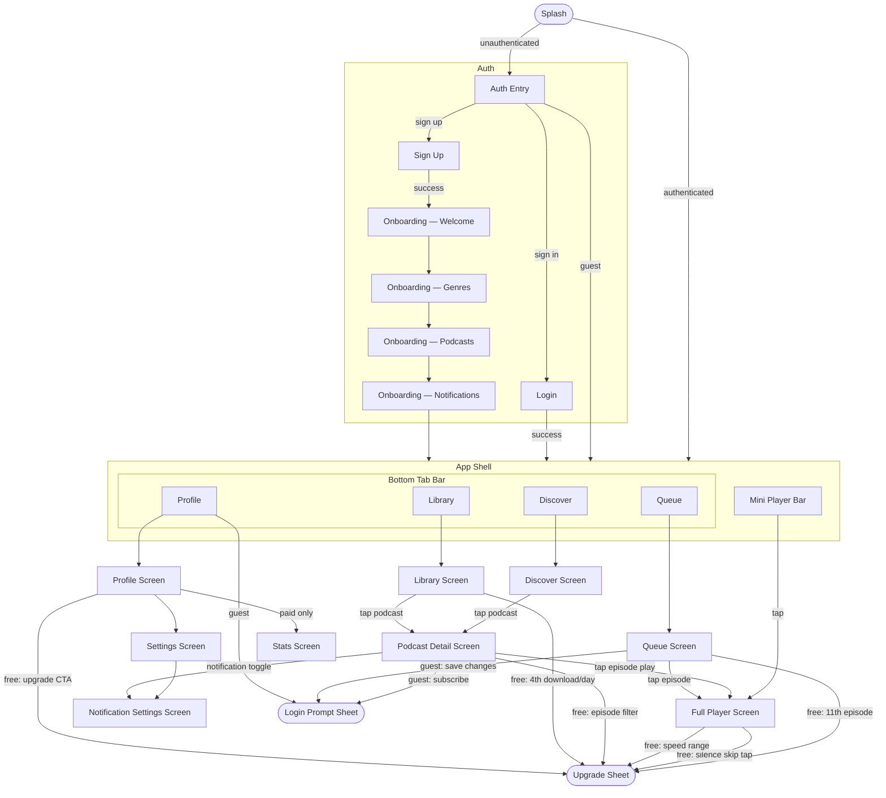

# Phase 3b — Mobile Features

## Goal
Implement full feature parity with the web app plus mobile-only features (downloads, lock screen,
push notifications, silence skipping), then ship to Google Play and the App Store.

All features follow the UDF pattern established in Phase 3a (see `docs/plans/phase-3a-mobile-setup.md`):
each feature gets a `<Feature>Feature.kt` (commonMain), `<Feature>Screen.kt` (commonMain),
and `<Feature>ViewModel.kt` (androidMain).

## Screens & User Flow

### Screen Inventory

#### Auth & Onboarding

| Screen | Contents |
|--------|----------|
| **Splash** | App logo; auto-redirects based on auth state |
| **Auth Entry** | Sign in / Sign up / Continue as Guest choices; Google OAuth; Apple Sign-In (iOS) |
| **Login** | Email + password; OAuth buttons; Forgot password link |
| **Sign Up** | Email + password; OAuth buttons |
| **Onboarding — Welcome** | Short app intro; "Get started" CTA |
| **Onboarding — Genre Selection** | Interest chips (Comedy, Tech, News, etc.); multi-select |
| **Onboarding — Suggested Podcasts** | Curated list based on selected genres; subscribe inline |
| **Onboarding — Notification Permission** | OS permission prompt with context message |

#### Main App (Bottom Tab Bar + Mini Player)

| Screen | Contents |
|--------|----------|
| **Discover** | Search bar; Trending section; Genre filter tabs; Podcast result grid |
| **Library** | Subscribed podcasts list (drag-to-reorder); Downloads section (downloaded episodes with offline badge) |
| **Queue** | Reorderable episode rows; free: capped at 10 / paid: unlimited; play, remove, reorder |
| **Profile** | Account info + tier badge; subscriptions list; listening stats (paid); upgrade CTA (free); Settings link; Sign out |

#### Shared / Deep-Navigated Screens

| Screen | Contents |
|--------|----------|
| **Podcast Detail** | Blurred artwork hero; Subscribe / Unsubscribe button; new-episode dot badge; episode filter pill (paid); per-podcast notification toggle; episode rows (play, queue, download, progress bar) |
| **Full Player** | Artwork, title, podcast name; scrubber + chapter markers; play/pause/skip ±15s; speed selector (1x/2x free — 0.5x–3x paid); silence skip toggle (paid only); sleep timer; queue-ahead preview |
| **Settings** | Notification Settings →; Playback defaults; OPML import/export (paid); Manage Subscription; Sign Out |
| **Notification Settings** | Master on/off toggle; per-podcast toggle list (mirrors per-podcast toggle on Podcast Detail); episode filter patterns (paid) |
| **Stats** | Total listening time; episodes per week chart; listening streak (paid only — accessible from Profile) |

#### Sheets (inline — no full-screen navigation)

| Sheet | Trigger |
|-------|---------|
| **Upgrade Sheet** | Hitting any free-tier limit: queue cap, speed range, silence skip, download quota, episode filter |
| **Login Prompt Sheet** | Guest taps Subscribe, saves queue changes, or navigates to Profile |

---

### Navigation Flow

---

### Free vs Paid Feature Gates

| Feature | Free | Paid |
|---------|------|------|
| Queue size | 10 episodes | Unlimited |
| Playback speed | 1x / 2x only | 0.5x – 3x full range |
| History retention | 30 days | Full (while subscribed) |
| Downloads | 3 / day | Unlimited |
| Silence skipping | — | ✓ |
| Episode filter patterns (notifications) | — | ✓ |
| Listening stats | — | ✓ |
| OPML import / export | — | ✓ |
| Banner ads in player | ✓ | — |
| Guest browsing (Discover, Queue, Podcast Detail) | ✓ | ✓ |

Subscription pricing matches web: **$4.99/month or $50/year** via in-app purchase (Apple / Google Play billing).
All free-tier gates show an **inline bottom sheet** (Upgrade Sheet) with the feature unlock list and a Subscribe CTA — no full-screen navigation required.

---

## Planned

### Core Features (parity with web)
- [ ] Auth — `AuthFeature` + `AuthScreen`; Supabase KMP Auth client; email + Google OAuth;
      Apple sign-in for iOS (expect/actual OAuth handler)
- [ ] Podcast search + subscribe — `SearchFeature` + `SearchScreen`; calls Supabase Edge Function
      (`/functions/v1/podcasts-search`); results rendered in lazy column
- [ ] Episode list + playback — `EpisodeListFeature` + `PlayerFeature`; audio via `Media3` (Android)
      / `AVPlayer` (iOS) behind expect/actual `AudioPlayer` interface
- [ ] Background audio playback — Android: `MediaSessionService` (Media3); iOS: `AVAudioSession`
      with background mode; controlled via `AudioPlayer` expect/actual
- [ ] Sync (progress, subscriptions, queue, history) — direct Supabase KMP client calls;
      RLS enforces per-user access; same DB schema as web
- [ ] Playlists — `PlaylistFeature`; CRUD via Supabase; sequential auto-advance; share via deep link

### Mobile-specific
- [ ] Download manager — `DownloadFeature`; Android: `WorkManager` + `DownloadManager`;
      iOS: `URLSession` background download task; expect/actual `Downloader` interface;
      free tier: 3 downloads/day; paid: unlimited (enforced in `DownloadFeature` via Supabase quota check)
- [ ] Lock screen / notification controls — Android: `MediaSession` + `MediaStyleNotification` (Media3);
      iOS: `MPNowPlayingInfoCenter` + `MPRemoteCommandCenter`; expect/actual `NowPlayingController`
- [ ] Push notifications for new episodes — Supabase Edge Function cron calls FCM (Android) / APNs (iOS);
      `last_feed_checked_at` cache column already in place from Phase 2.5
- [ ] Silence skipping (paid only) — Android: `AudioRecord` + `AudioTrack`; iOS: `AVAudioEngine`;
      expect/actual `SilenceSkipper`; no CORS restriction on native (unlike web)

### Testing
- [ ] Unit tests for `DownloadFeature` (quota enforcement, state transitions) using Turbine + MockK
- [ ] Unit tests for `PlayerFeature` (play/pause/seek/queue advance) using Turbine + MockK
- [ ] Maestro E2E (Android): search → subscribe → download → offline playback flow
- [ ] Maestro E2E (Android): free-tier download limit enforced after 3/day
- [ ] iOS: XCUITest or manual QA for auth, playback, lock screen controls

### Release
- [ ] Android: Google Play Store submission
- [ ] iOS: App Store submission (requires Apple Developer account)
